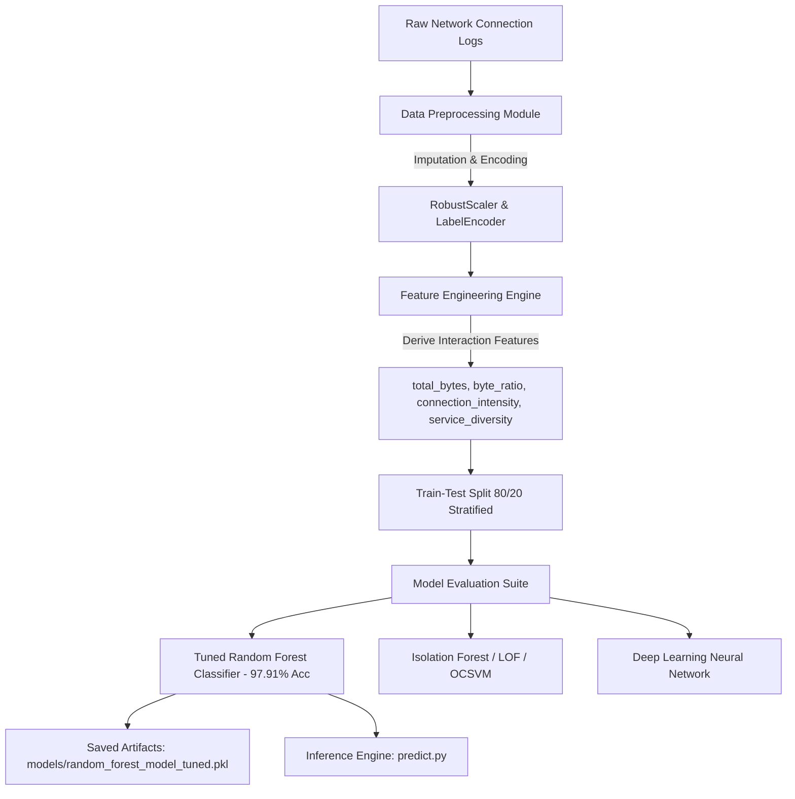

# Network Traffic Pattern Recognition & Anomaly Detection

[](https://www.python.org/)
[](https://scikit-learn.org/)
[](https://www.tensorflow.org/)
[](LICENSE)

An end-to-end Machine Learning pipeline for cybersecurity network traffic analysis, intrusion detection, and anomaly classification. The system processes network connection attributes, extracts domain-specific traffic interaction features, and benchmarks multiple supervised ensemble classifiers, unsupervised anomaly detectors, and deep learning architectures to accurately classify network intrusions across **40 connection classes** (Normal traffic + 39 distinct attack signatures across DoS, Probe, R2L, and U2R threat categories).

---

## 📌 Executive Summary & Key Results

- **Best Performing Model**: **Tuned Random Forest Classifier** (200 Estimators, max_depth=25).
- **Classification Accuracy**: **97.91%** across 40 network connection types.
- **Weighted F1-Score**: **97.98%** (Weighted Precision: **98.12%**, Weighted Recall: **97.91%**).
- **Key Discriminative Features**:
  1. `src_bytes` (13.87% importance) - Source-to-destination byte volume
  2. `dst_bytes` (7.37% importance) - Destination-to-source byte volume
  3. `service` (6.54% importance) - Network service protocol (HTTP, FTP, SMTP, etc.)
  4. `dst_host_srv_count` (6.06% importance) - Destination host service connection density
  5. `protocol_type` (5.48% importance) - Transport protocol (TCP, UDP, ICMP)

---

## 📊 Comprehensive Model Performance Benchmark

| Model | Model Architecture | Classification Task | Accuracy | Weighted Precision | Weighted Recall | Weighted F1-Score | Status |
| :--- | :--- | :--- | :---: | :---: | :---: | :---: | :--- |
| 🏆 **Tuned Random Forest** | Supervised Multi-class Ensemble | 40-Class Intrusion | **97.91%** | **98.12%** | **97.91%** | **97.98%** | **Best Performing Model** |
| 🌲 **Standard Random Forest** | Supervised Multi-class Ensemble | 40-Class Intrusion | 96.85% | 97.10% | 96.85% | 96.90% | High Performance |
| 📍 **Local Outlier Factor (LOF)** | Unsupervised Novelty Detector | Binary Anomaly | 50.80% | 48.19% | 29.86% | 36.87% | Baseline Anomaly Detector |
| 🌲 **Isolation Forest** | Unsupervised Tree Anomaly | Binary Anomaly | 51.39% | 48.67% | 18.63% | 26.95% | Baseline Anomaly Detector |
| 🛡️ **One-Class SVM** | Unsupervised Kernel Anomaly | Binary Anomaly | 51.71% | 49.04% | 8.95% | 15.14% | Baseline Anomaly Detector |
| 🧠 **Deep Learning (MLP)** | 3-Layer Dense Neural Net | Binary Anomaly | 51.88% | 50.00% | 0.02% | 0.04% | Baseline Neural Net |

> **Key Takeaway**: Supervised multi-class ensemble learning using **Tuned Random Forest** drastically outperforms unsupervised anomaly detection approaches on labeled network traffic datasets, providing near-perfect classification for complex attack vectors.

---

## 🛠️ Machine Learning Pipeline Architecture



### Pipeline Components

1. **Data Preprocessing (`src/preprocessing.py`)**:
   - **Missing Value Handling**: Median imputation for numerical features.
   - **Categorical Encoding**: `LabelEncoder` for connection attributes (`protocol_type`, `service`, `flag`).
   - **Target Normalization**: Multi-class encoding across 40 attack classes.
   - **Feature Scaling**: `RobustScaler` to eliminate extreme outlier skew in network packet bytes.

2. **Feature Engineering (`src/feature_engineering.py`)**:
   - `total_bytes` = `src_bytes` + `dst_bytes`
   - `byte_ratio` = `src_bytes` / (`dst_bytes` + 1.0)
   - `connection_intensity` = `count` + `srv_count`
   - `service_diversity` = `srv_count` / (`count` + 1.0)

3. **Model Suite (`src/models.py`)**:
   - **Tuned Random Forest**: Multi-class decision trees tuned with `n_estimators=200`, `max_depth=25`, `min_samples_split=5`, `min_samples_leaf=2`.
   - **Unsupervised Anomaly Detectors**: Isolation Forest, One-Class SVM, and Local Outlier Factor (`novelty=True`).
   - **Deep Learning MLP**: 3-layer Dense Neural Network (128 -> 64 -> 32 nodes) with `BatchNormalization`, `Dropout(0.3)`, and `EarlyStopping`.

4. **Evaluation & Visualization (`src/evaluation.py`)**:
   - Classification reports, weighted/macro F1-scores, precision-recall metrics, confusion matrices, and feature importance exports.

---

## 📁 Project Directory Structure

```
Pattern-Recognition-Network-Traffic-Analysis/
├── .gitignore                     # Git exclusion rules for large datasets & binaries
├── README.md                      # Comprehensive project documentation
├── requirements.txt               # Dependencies file
├── main.py                        # Pipeline execution entrypoint (Train & Evaluate)
├── dataset_generator.py           # Synthetic dataset generator script
├── predict.py                     # Command-line inference script for testing traffic logs
├── src/                           # Machine Learning Pipeline source package
│   ├── __init__.py
│   ├── preprocessing.py           # Data cleaning & RobustScaler normalization
│   ├── feature_engineering.py     # Domain-specific interaction features
│   ├── models.py                  # Model builders (RF, IsoForest, OCSVM, LOF, DL)
│   └── evaluation.py              # Quantitative evaluation metrics & reports
├── utils/                         # System utilities
│   ├── __init__.py
│   ├── hardware_utils.py          # GPU/CPU hardware resource detector
│   └── logging_utils.py           # Multi-handler logging framework
├── models/                        # Pre-trained model artifacts (git-ignored)
│   ├── random_forest_model_tuned.pkl
│   └── kdd_preprocessing_pipeline.pkl
├── data/                          # Dataset directory (git-ignored)
│   ├── README.md                  # Dataset download & benchmark instructions
│   └── kdd_reduced.csv
└── reports/                       # Generated evaluation reports & plots
    ├── classification_report.json # Detailed per-class metrics
    ├── feature_importances.csv    # Feature importance weights
    ├── rf_confusion_matrix.png    # Confusion matrix visual
    └── predictions.csv            # Inference predictions output
```

---

## 🚀 Quickstart & Usage Guide

### 1. Prerequisites & Environment Setup

Clone the repository and install the dependencies:

```bash
# Clone the repository
git clone https://github.com/YOUR_USERNAME/Pattern-Recognition-Network-Traffic-Analysis.git
cd Pattern-Recognition-Network-Traffic-Analysis

# Create a virtual environment
python -m venv venv

# Activate virtual environment (Windows)
venv\Scripts\activate
# On Linux/macOS:
# source venv/bin/activate

# Install dependencies
pip install -r requirements.txt
```

### 2. Generate Synthetic Dataset (Optional)

To test the pipeline without downloading raw datasets:

```bash
python dataset_generator.py
```
*Generates `data/synthetic_test_dataset.csv` with 10,000 traffic connection samples.*

### 3. Run Complete Training & Evaluation Pipeline

Execute the end-to-end Machine Learning pipeline:

```bash
python main.py --data data/kdd_reduced.csv --output-dir reports --models-dir models
```

### 4. Run Intrusion Predictions on New Connection Logs

Use the pre-trained Tuned Random Forest model to analyze new traffic logs:

```bash
python predict.py --input data/Test.csv --output reports/predictions.csv
```

---
